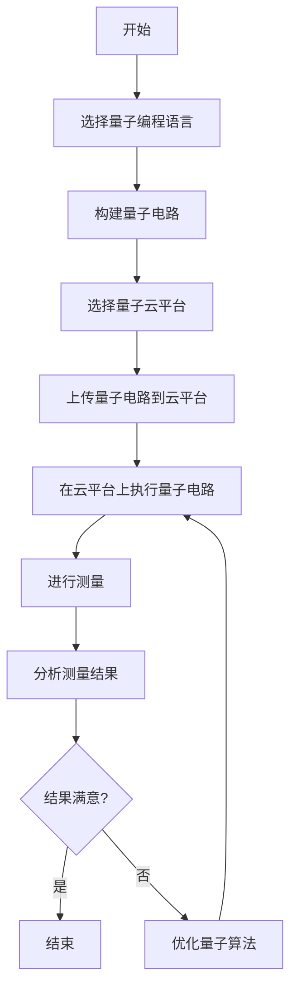
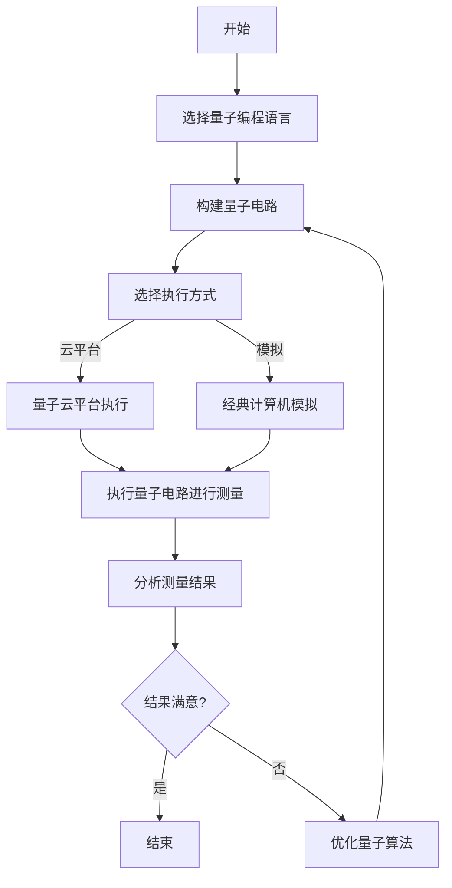
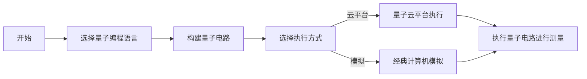

## User: 量子线路的定义是什么
Kimi: 量子线路（Quantum Circuit），也称为量子电路或量子门电路，是量子计算中用于描述量子算法的一种图形化表示方法。它类似于经典计算中的逻辑电路，但专门用于处理量子信息。

### 量子线路的定义和组成

1. **量子位（Qubits）**：量子线路由一定数量的量子位组成，这些量子位是量子计算的基本单元，可以处于叠加态和纠缠态。

2. **量子门（Quantum Gates）**：量子线路通过一系列量子门来操作量子位。量子门是可逆的，并且可以用酉矩阵表示。常见的量子门包括单量子位门（如Hadamard门、Pauli-X门、Pauli-Y门、Pauli-Z门）和双量子位门（如CNOT门、CZ门）等。

3. **测量（Measurement）**：量子线路通常以测量操作结束，将量子位的状态转换为经典信息。测量会导致量子位的波函数坍缩，从而得到一个确定的测量结果。

4. **时间演化（Time Evolution）**：量子线路中的操作按照时间顺序执行，每个量子门对应一个特定的时间步骤。量子线路的深度（Depth）是指电路中最长的路径上的量子门数量。

5. **控制结构（Control Structures）**：量子线路可以包含条件操作和循环结构，以实现更复杂的算法。例如，受控门（如受控非门CNOT）可以根据控制量子位的状态来决定是否对目标量子位执行操作。

### 量子线路的应用

量子线路是实现量子算法的基础，它们用于：

- **量子模拟**：模拟量子系统的物理行为，如分子结构和化学反应。
- **量子优化**：解决优化问题，如旅行商问题和组合优化问题。
- **量子搜索**：如Grover算法，用于在未排序数据库中搜索特定元素。
- **量子加密**：如量子密钥分发（QKD），用于安全通信。
- **量子机器学习**：利用量子计算加速机器学习算法。

量子线路的设计和优化是量子计算研究中的一个重要领域，旨在提高量子算法的效率和可扩展性。随着量子硬件的发展，量子线路将在量子计算的实际应用中发挥越来越重要的作用。
## User: 什么是量子算法，有什么方法可有检验算法
Kimi: ### 量子算法的定义

量子算法是运行在量子计算机上的算法，利用量子计算的特性，如量子叠加、量子纠缠和量子隧穿等，来解决特定问题。与经典算法相比，量子算法在某些情况下能够显著提高计算速度和效率，解决一些经典计算机难以解决的问题。

### 量子算法的特点

1. **并行性**：量子算法可以利用量子叠加实现大规模的并行计算，从而加速某些特定问题的求解过程。
2. **纠缠性**：量子算法可以利用量子纠缠实现量子比特之间的关联，从而提高算法的效率和准确性。
3. **可逆性**：量子算法中的操作是可逆的，这有助于减少能量消耗并提高计算的准确性。

### 常见的量子算法

1. **Shor算法**：用于大整数分解，可以破解许多现有的加密算法，如RSA。
2. **Grover算法**：用于无序数据库的搜索问题，可以加速搜索过程。
3. **量子相位估计算法**：用于求解特征值问题，是量子模拟和量子优化算法的基础。
4. **量子模拟算法**：用于模拟量子系统，如量子化学和量子物理中的系统。

### 检验量子算法的方法

1. **理论分析**：通过数学推导和理论分析，研究量子算法的性能，如时间复杂度、空间复杂度和错误率等。

2. **量子电路模拟**：在经典计算机上模拟量子电路的运行，以验证量子算法的正确性和效率。这种方法适用于小规模的量子电路。

3. **量子硬件实验**：在实际的量子计算机上运行量子算法，以验证算法的性能和可行性。这种方法可以提供更准确的结果，但受限于当前量子硬件的规模和精度。

4. **基准测试**：通过在量子计算机上运行一系列标准问题，评估量子算法的性能。例如，量子随机行走、量子相位估计等。

5. **错误率分析**：分析量子算法在实际运行中的错误率，如量子退相干、量子噪声等，以评估算法的鲁棒性。

6. **比较分析**：将量子算法的性能与经典算法进行比较，评估量子算法的优势和局限性。

7. **优化和改进**：根据检验结果，对量子算法进行优化和改进，以提高其性能和实用性。

总之，量子算法是量子计算领域的重要研究方向，通过理论分析、模拟实验和硬件实验等方法，可以检验和改进量子算法，推动量子计算技术的发展。
## User: 如何利用量子计算云平台或者量子编程语言实现量子算法
Kimi: 利用量子计算云平台或者量子编程语言实现量子算法，可以通过以下步骤进行：

1. **选择量子编程语言**：首先，需要选择一种量子编程语言，如Qiskit、Cirq、Q#等。这些语言提供了构建量子电路、实现量子算法所需的工具和库。

2. **构建量子电路**：使用所选的量子编程语言，构建量子电路。量子电路由量子门组成，这些门定义了量子比特（qubits）之间的操作和相互作用。例如，在Qiskit中，可以使用Hadamard门和CNOT门来创建纠缠态[^45^][^46^]。

3. **使用量子云平台**：利用量子云平台，如IBM Quantum Experience、亚马逊Braket和微软Azure Quantum等，将构建的量子电路上传到云平台，通过云服务接口API接收用户提交的量子电路，将任务分配给量子处理器执行。这些平台提供量子模拟和量子硬件执行的能力，允许用户在真实的量子计算机上运行算法[^44^]。

4. **执行和测量**：在量子云平台上执行量子电路，并进行测量以获取结果。测量过程会将量子态转换为经典信息，从而可以分析算法的性能和结果。

5. **分析和优化**：根据测量结果，分析量子算法的性能，并根据需要对算法进行优化。这可能包括调整量子门的参数、改进量子电路的设计等。

6. **重复执行**：量子算法可能需要多次执行以获得可靠的结果，因为量子计算中存在概率性和不确定性。通过重复执行，可以提高结果的准确性和可靠性。

通过以上步骤，可以在量子计算云平台或使用量子编程语言实现量子算法，并在量子硬件上进行测试和验证。
## User: 把这个步骤生成流程图
Kimi: 以下是使用mermaid格式生成的流程图，描述了使用量子计算云平台或量子编程语言实现量子算法的步骤：



这个流程图从选择量子编程语言开始，接着构建量子电路，然后选择一个量子云平台并上传量子电路。之后，在云平台上执行量子电路并进行测量，分析测量结果。如果结果不满意，返回优化量子算法的步骤，然后重复执行直到结果满意为止。
## User: graph TD
    A[开始] --> B[选择量子编程语言]
    B --> C[构建量子电路]
    C --> D[量子云平台]
    C --> E[经典计算机模拟]
    E --> F[执行量子电路进行测量]
    E --> F
Kimi: 您提供的流程图代码中存在一点小错误，两条边同时指向了同一个节点 `F`，这可能会导致理解上的混淆。我将对流程图进行修正，以更清晰地展示流程：



这个修正后的流程图展示了以下步骤：

1. **开始**：流程的起点。
2. **选择量子编程语言**：选择适合的量子编程语言，如Qiskit、Cirq等。
3. **构建量子电路**：使用所选的量子编程语言构建量子电路。
4. **选择执行方式**：决定是在量子云平台上执行还是在经典计算机上进行模拟。
5. **量子云平台执行**：如果选择云平台，将量子电路上传到量子云平台执行。
6. **经典计算机模拟**：如果选择模拟，使用经典计算机模拟量子电路的执行。
7. **执行量子电路进行测量**：无论是在云平台还是模拟环境中，执行量子电路并进行测量。
8. **分析测量结果**：分析测量得到的结果。
9. **结果满意？**：检查结果是否满意。
   - 如果满意，流程结束。
   - 如果不满意，优化量子算法并返回到构建量子电路的步骤。

这个流程图更清晰地展示了从选择量子编程语言到优化量子算法的整个过程，包括在量子云平台和经典计算机上执行量子电路的两种方式。
## User: 去掉后面的是否满意，并把这个流程图变成从左到右吗
Kimi: 当然可以，以下是从左到右的流程图，省略了结果满意度检查的部分：



这个流程图描述了以下步骤：

1. **开始**：流程的起点。
2. **选择量子编程语言**：选择一个合适的量子编程语言。
3. **构建量子电路**：使用所选的量子编程语言构建量子电路。
4. **选择执行方式**：决定是在量子云平台上执行还是在经典计算机上进行模拟。
5. **量子云平台执行**：如果选择云平台，将量子电路上传到量子云平台执行。
6. **经典计算机模拟**：如果选择模拟，使用经典计算机模拟量子电路的执行。
7. **执行量子电路进行测量**：无论是在云平台还是模拟环境中，执行量子电路并进行测量。

这个流程图清晰地展示了从选择量子编程语言到执行量子电路并进行测量的整个过程。
## User: 详细介绍一下量子算法
Kimi: 量子算法是利用量子计算原理进行的计算方法，它能够在特定问题上比经典算法更高效地解决复杂计算任务。量子算法的核心优势之一在于其卓越的计算速度，这得益于量子比特（qubit）的独特性质。与传统计算机使用的经典比特不同，量子比特可以同时处于多种状态，利用叠加和纠缠现象，使得量子计算机能够在进行大规模计算时展现出超越经典计算机的潜力。具体来说，许多需要指数级时间才能解决的问题，在量子算法的帮助下，可以在多项式时间内完成。例如，Shor算法能够有效地分解大整数，从而在加密领域带来革命性的影响[^49^][^49^]。

量子算法在数据处理领域展现出显著的潜力，尤其是在大数据分析、机器学习和优化问题方面。传统计算机在处理海量数据时，常常面临速度瓶颈和资源消耗问题，而量子计算机凭借其独特的量子叠加和纠缠特性，能够以指数级的速度处理复杂数据集。以量子支持向量机（QSVM）为例，该算法能够更为高效地进行分类任务，特别是在样本数据维度较高时。相较于经典算法，QSVM通过将数据映射到高维空间，并利用量子叠加状态对样本进行并行处理，实现了更快的训练速度和更高的分类准确率。同时，这种方法还能显著降低计算成本，使得大规模数据分析变得更加可行[^49^]。

量子算法在信息安全领域展现出巨大的潜力，特别是在加密技术的革新上。经典计算机在处理某些复杂性问题时，所需的时间和资源巨大，这使得现有的加密方法面临威胁。尤其是诸如RSA和ECC等基于数论的加密算法，在面对量子计算机时，其安全性可能会被轻易破译。因此，寻求新型的量子安全算法已成为必要[^49^][^49^]。

量子算法正以其独特的计算能力，引领人工智能领域的创新发展。传统的机器学习算法在处理复杂数据时往往面临计算瓶颈，而量子计算能够通过量子叠加和纠缠等特性，显著提高数据处理效率。量子计算机能够同时处理多个状态，这使得它们在优化任务、分类和聚类等领域表现出极大的潜力[^49^]。

量子算法在金融行业的应用前景无疑是颇具潜力的，其核心优势主要体现在计算速度和数据处理能力的提升。传统金融市场依赖于复杂的算法和庞大的数据分析，而量子算法通过量子叠加和量子纠缠等特性，能够在处理大量复杂数据时显著降低计算时间。这对于高频交易、风险管理、资产定价等领域尤为重要[^49^]。
## User: 介绍一下啊Cirq
Kimi: Cirq是由Google开发的开源量子计算编程框架，它专注于量子算法的开发和演示，并提供了一套灵活的工具和库，可以在量子计算机上进行量子计算的模拟和实验。Cirq的主要特点包括面向研究和教育、灵活的模拟、可扩展性以及强大的调试工具[^55^][^58^]。它支持多种不同类型的量子计算架构，包括通用量子计算和量子模拟，这使得用户可以自由地在不同的硬件平台和算法中进行开发和测试[^55^]。

Cirq是一个Python框架，用于创建、编辑和调用噪声中尺度量子(NISQ)电路。它不一定需要实际的量子计算机来执行，Cirq还可以使用类似模拟器的界面来执行量子电路模拟[^56^]。Cirq是一个用于为噪声中等规模量子（NISQ）设备编写量子算法的框架。NISQ设备是那些具有$O(100)$量子比特并且可以执行$O(1000)$门操作的设备。Cirq提供了有用的抽象处理，用于处理当今的噪声中等规模量子计算机[^57^]。

Cirq框架以其无与伦比的灵活性和高效性赢得了众多开发者的心。它不仅简化了量子算法的设计流程，还极大地提高了算法的执行效率。Cirq支持多种编程语言，这意味着开发者可以根据自身的技术栈选择最适合的工具来进行开发[^58^]。Cirq是Google开源的一个用于构建量子计算程序的Python库，提供了量子计算机的模拟器、量子算法的实现等功能[^59^]。
## User: 介绍一下Qiskit
Kimi: Qiskit是一个由IBM开发的开源量子计算软件开发框架，旨在利用当今的量子处理器进行研究、教育和商业活动[^70^][^74^]。它支持多种量子计算平台，包括量子模拟器和真实量子计算机[^74^]。Qiskit的目标是使开发者能够利用量子计算的潜力，并为其提供必要的工具[^74^]。

Qiskit的主要组件包括：
- **Qiskit Terra**：提供基本的构建块和API，允许用户构建量子电路。
- **Qiskit Aer**：用于模拟量子电路和量子计算的工具。
- **Qiskit Ignis**：用于量子误差校正和噪声研究的组件。
- **Qiskit Aqua**：用于应用于量子算法的高层次接口。
- **Qiskit Nature**：专注于化学和物理的量子应用[^74^][^75^]。

Qiskit框架以其简洁直观的Python语言接口，极大地降低了量子编程的入门门槛[^73^]。它涵盖了从基础量子门操作、电路构建，到高级量子算法实现、量子纠错以及与真实量子硬件交互等一整套完备功能[^73^]。Qiskit的架构设计精妙绝伦，主要涵盖了Terra、Aer、Ignis和Aqua四大核心组件，每个组件各司其职，又相互协作，共同为量子编程提供全方位的支持[^73^]。

Qiskit的代码库托管在GitHub上，访问 Qiskit GitHub主页 可以找到所有相关资源。此主页提供了最新的代码、文档、示例以及社区讨论[^74^]。安装过程简单，通常只需以下几步：
1. 确保已安装Python 3.6及以上版本。
2. 使用pip安装Qiskit：`pip install qiskit`
3. 验证安装：`import qiskit; print(qiskit.__version__)`[^74^]。

Qiskit提供了直观的API，可以帮助用户创建量子电路。以下是一个简单的示例：
```python
from qiskit import QuantumCircuit
qc = QuantumCircuit(2)
qc.h(0) # 应用Hadamard门
qc.cx(0, 1) # 应用CNOT门
qc.measure_all() # 测量所有量子比特
```
Qiskit的开源特性鼓励开发者贡献代码。用户可以通过以下方式参与：
- **提交问题**：如果发现Bug或有建议，可以在GitHub上提交issue。
- **拉取请求**：通过代码贡献来增强Qiskit功能。
- **社区支持**：参与Qiskit社区的讨论，交流使用经验[^74^]。

为了帮助用户上手，Qiskit社区提供了丰富的学习资源：
- **Qiskit文档**：包含详细的API文档和使用指南。
- **在线课程**：IBM Quantum Experience平台提供的量子计算课程。
- **Jupyter Notebook示例**：提供可直接运行的代码示例[^74^]。
## User: 介绍一下Q#
Kimi: Q# 是一种由 Microsoft 开发的专门用于量子计算的高级开源编程语言[^90^][^93^]，它包含在 Quantum 开发工具包（QDK）中。Q# 旨在帮助开发人员利用量子计算的潜力来解决复杂问题。它提供声明式编程方法，集成开发环境，丰富的库和工具，可扩展性和互操作性，量子模拟器和开源支持[^93^]。Q# 支持硬件不可知的量子算法开发，使得编写的量子程序可以在不同的量子计算机和模拟器上运行[^90^]。

Q# 项目是具有多个 Q# 文件的文件夹结构，可以访问彼此的操作和函数。项目有助于在逻辑上组织源代码。还可以将项目用作可从外部源访问的自定义库[^92^]。Q# 附带了一个量子模拟器，允许开发人员在不使用实际量子计算硬件的情况下测试和验证量子程序的行为[^93^]。这使得开发人员能够在开发和调试过程中更轻松地测试他们的量子算法。

Q# 程序的结构包括操作（Operations）、函数（Functions）和类型（Types）。操作是量子程序中的基本构建块，可以包含量子门操作序列。函数用于执行经典计算任务，而类型则用于定义量子数据结构[^95^]。Q# 还支持在 Visual Studio Code 中创建 Q# 项目，包括：qsharp.json清单文件和具有默认 main.qs 文件的 src 子文件夹[^91^]。

总的来说，Q# 是一个强大的工具，用于探索和利用量子计算的潜力。它使开发人员能够更轻松地进入量子计算领域，并为解决复杂问题提供了新的方法。虽然量子计算技术仍在不断发展，但 Q# 为开发人员提供了一个强大的工具，可以在这个领域做出贡献[^93^]。
## User: 介绍一下Qpanda
Kimi: QPanda是一种功能齐全、运行高效的量子软件开发工具包，它是一款开源的量子计算框架，可以用于构建、运行和优化量子算法。QPanda提供了丰富的量子计算编程基础组件，包括量子比特和量子门操作，开发者可以使用这些组件来构建复杂的量子算法，从简单的量子门序列到更复杂的量子电路。这些基础组件为开发者提供了构建量子计算任务所需的核心工具。此外，QPanda还提供了高性能量子虚拟机，允许开发者在经典计算机上进行高效的量子模拟，使开发者能够在不依赖实际量子硬件的情况下测试和优化他们的算法[^104^][^106^]。
QPanda 2是由本源量子开发的开源量子计算框架，它可以用于构建、运行和优化量子算法。QPanda 2作为本源量子计算系列软件的基础库，为OriginIR、Qurator、量子计算服务提供核心部件。为了方便用户使用，QPanda 2为用户提供了Python版本的pyQPanda，详情请参考 pyQPanda使用文档[^105^][^107^][^110^]。
## User: 典型的量子云平台有哪些？分别详细介绍yix
Kimi: 以下是一些典型的量子云平台及其详细介绍：

1. **本源量子云**：本源量子云提供真实量子计算、量子计算模拟器和超-量混合计算后端接入，为开发者提供基础软件与开发工具，为生物化学、金融科技、大数据、机器学习等先进企业提供行业应用服务[^115^][^117^]。

2. **Azure Quantum**：Azure Quantum 是 Microsoft 提供的量子云计算服务，它提供创新的量子硬件、软件和解决方案。Azure Quantum 允许用户通过云服务获取量子硬件的多样化组合，构建容错量子系统，并提供开源开发工具包来支持 Q#、Qiskit 和 Cirq 等语言。此外，它还提供资源估算器工具来估计未来缩放量子计算机上运行量子应用程序所需的逻辑和物理量子比特数量以及运行时间[^116^]。

3. **启科量子云平台**(Qu|Cloud)：启科量子打造的“量子-经典混合算力云平台”正式上线，面向全球用户开放注册和使用。该平台为用户提供量子计算机、量子模拟器、量子编程环境等多种类型的计算资源与服务，帮助用户进行算法设计、理论研究和应用探索[^118^]。

4. **量旋云**：量旋云是一个链接多种真实量子计算体系的云服务平台，其搭载了高达8、5、3、2个比特的量子计算机，同时具有多达24比特高性能模拟平台，满足科研工作者的研究需求，也可为量子计算领域的兴趣爱好者提供充足的机时[^121^]。

这些平台通过提供量子计算资源和服务，推动量子计算算法研究、应用探索和产业生态建设，逐渐成为业界共识。
## User: 还有吗
Kimi: 除了前面提到的本源量子云、Azure Quantum、启科量子云平台和量旋云，还有其他一些典型的量子云平台：

1. **QPanda 2**：QPanda 2是由本源量子开发的开源量子计算框架，它可以用于构建、运行和优化量子算法。QPanda 2作为本源量子计算系列软件的基础库，为OriginIR、Qurator、量子计算服务提供核心部件。为了方便用户使用，QPanda 2为用户提供了Python版本的pyQPanda，详情请参考 pyQPanda使用文档[^127^][^129^]。

2. **量-超-云融合**：量超融合是量子-经典混合计算的一个重要场景，其中量子计算任务由本源超导量子计算机“悟空”号来处理，经典计算任务则由超算处理，利用二者之间的各自优势进行协调计算以解决问题。目前基于超算和悟空量子计算机的融合计算平台已建设完成，用户可以在线申请使用[^131^]。
## User: IBM Quantum Experience、亚马逊 Braket 和微软 Azure Quantum
Kimi: 以下是几个典型的量子云平台的详细介绍：

1. **IBM Quantum Experience**：
   - IBM Quantum Experience 是一个量子计算云平台，允许用户在 IBM 的真实量子计算机上运行量子算法。它提供了一个用户友好的界面，以及一套量子编程工具，如 Qiskit，来设计和测试量子电路。IBM Quantum Experience 旨在促进量子计算的研究和教育，使量子计算对更广泛的用户群体开放[^143^][^144^]。

2. **亚马逊 Braket**（Amazon Braket）：
   - Amazon Braket 是一项完全托管的量子计算服务，旨在帮助加快量子计算的科学研究和软件开发。它允许用户轻松处理不同类型的量子计算机和电路模拟器，使用一组一致的开发工具。Braket 提供了对超导、俘获离子和中性原子设备的支持，以及量子硬件研究的界限突破。此外，它还提供了软件开发工具包（SDK）、简单的定价和工作流管理，以及开源软件的开发支持[^143^][^144^][^145^]。

3. **微软 Azure Quantum**：
   - Azure Quantum 是微软提供的量子云计算服务，构建在可信赖、可扩展且高度安全的 Azure 平台上。它包括来自微软和合作伙伴的多样化量子硬件和软件解决方案，提供了一个开放、灵活的环境，适应用户需求，加速进展并确保技术的未来发展。Azure Quantum 支持 Cirq、Qiskit 和 Q# 等编程语言，允许用户在多个平台上创建和运行算法，同时保留针对特定系统进行调整的能力[^146^][^149^]。
## User: 亚马逊 Braket 的定价是怎样的？
Kimi: 亚马逊 Braket 的定价策略是无预付款，您只需为使用的 AWS 资源付费。Amazon Braket 提供对量子计算机、量子电路模拟器、混合量子经典算法的完全托管执行以及 Jupyter 笔记本开发环境的按需专用访问权限。您需要为使用这些功能以及与 Amazon Braket 结合使用的其他 AWS 服务（例如用于存储量子计算结果的 Amazon Simple Storage Service（S3））单独付费。

在 Amazon Braket 上按需使用量子计算机或量子处理单元（QPU）时有两个定价组成部分：每次执行费用和每项任务费用。执行是在 QPU 上单次执行量子算法。任务是基于相同电路设计或哈密顿量的一系列重复执行。所有 QPU 的每项任务定价都相同。每次执行定价取决于所使用的 QPU 类型。对于基于门的 QPU，每次执行价格不受量子电路中使用的门数或类型的影响[^154^][^155^]。
## User: Qiskit的安装要求是什么
Kimi: Qiskit的安装要求包括以下几点：

1. **Python版本**：建议使用Python 3.6及以上版本。这是Qiskit运行的基础环境，确保Python版本符合要求可以避免安装过程中出现兼容性问题。

2. **操作系统**：Qiskit支持64位操作系统，如Ubuntu 16.04、macOS 10.12.6、Windows 7及以上版本。这确保了Qiskit可以在主流操作系统上运行，满足不同用户的需求[^168^][^169^]。

3. **基础函数库**：Qiskit安装过程中可能需要一些基础函数库，如Numpy-1.19.3等。这些库为Qiskit提供了必要的数学和科学计算支持，确保安装这些库可以保证Qiskit正常运行[^168^]。

安装Qiskit的步骤通常包括：
- 创建Python虚拟环境以避免与其他应用程序发生冲突。
- 使用pip安装Qiskit及其相关组件，例如`pip install qiskit`。
- 如果需要使用Qiskit的可视化功能或Jupyter笔记本，建议安装具有额外可视化支持的Qiskit（`'qiskit[visualization]'`）[^162^]。
- 定期检查Qiskit发行说明以查看新版本，并更新`qiskit`和`qiskit-ibm-runtime`以保持最新[^162^]。

通过遵循这些安装要求和步骤，用户可以确保Qiskit在他们的系统上正确安装和运行。
## User: 详细解释Deutsch-Jozsa算法
Kimi: Deutsch-Jozsa算法是量子计算中一个重要的算法，它由David Deutsch和Richard Jozsa在1992年提出。该算法旨在解决所谓的Deutsch-Jozsa问题，即确定一个给定的二进制函数是常数函数还是平衡函数。在经典计算中，确定函数是否为常数或平衡需要至少N/2+1次查询，其中N是函数可能输入的数量。然而，Deutsch-Jozsa算法只需一次函数查询就能解决这个问题，比任何经典算法都要快得多[^172^][^173^]。

算法的步骤如下：

1. 准备两个N+1比特的量子寄存器，其中一个用于存储输入值，另一个用于存储输出值。将两个寄存器都初始化为\(|0\rangle\)状态。
2. 应用Hadamard门（H门）到输入寄存器的每个比特上，将其变为一个叠加态。
3. 应用一个特殊的量子函数Uf，其中Uf\(|x\rangle|y\rangle = |x\rangle|y \oplus f(x)\rangle\)，其中\(\oplus\)表示按位异或操作，f(x)表示函数在输入x上的值。
4. 应用Hadamard门到输入寄存器的每个比特上。
5. 度量输入寄存器。如果测量结果为\(|0\rangle\)，则说明函数是常量函数；如果测量结果为非\(|0\rangle\)，则说明函数是平衡函数[^173^][^171^]。

Deutsch-Jozsa算法利用量子叠加和量子干涉原理，通过一次函数评估就能确定函数是常数还是平衡，这在经典计算中需要指数级时间才能完成[^172^]。算法的重要性在于其在密码学中的应用，例如评估加密函数的强度，并作为更复杂量子算法的基础，如Simon算法和Shor算法[^172^]。此外，Deutsch-Jozsa算法展示了量子计算在某些情况下比经典计算更高效的潜力，对于量子计算的发展和理论研究具有重要意义[^173^]。
## User: 详细解释Grover搜索算法
Kimi: Grover搜索算法是由Lov Grover在1996年提出的一种量子算法，它主要用于解决无序数据库搜索问题，即在一个无序的数据库中寻找特定的元素。Grover算法被认为是继Shor算法之后的第二大量子算法，也是第一个被完整实验实现的量子算法[^175^][^176^]。

### Grover算法的基本原理

Grover算法的基本原理是利用量子叠加和量子干涉来放大目标态的概率振幅，同时抑制非目标态的概率振幅，这个过程被称为振幅放大。通过这种方式，Grover算法能够在多项式时间内找到一个无序数据库中的所有匹配项[^175^][^176^]。

### Grover算法的步骤

Grover搜索算法主要包括以下步骤：

1. **数据库初始化**：对\(\|0\rangle^{\otimes n}\)执行\(H^{\otimes n}\)操作，使得数据库被初始化为一个均匀叠加态，即
   \[
   \|\psi_0\rangle = H^{\otimes n}\|0\rangle^{\otimes n} = \frac{1}{\sqrt{N}}\sum_{i=0}^{N-1}\|i\rangle.
   \]

2. **Grover迭代**：Grover迭代可以分解为四步：
   - 执行Oracle算子\(U_{\omega}\)，翻转目标态\(\|\omega \rangle\)的相位。
   - 对\(n\)位量子比特执行\(H^{\otimes n}\)操作。
   - 执行条件相移算子\(P\)，使\(\|0\rangle\)态以外的每个态的相位都翻转。
   - 再次执行\(H^{\otimes n}\)操作。
   完整的\(G\)算子可以表示为
   \[
   G = H^{\otimes n} [2(\|0\rangle\langle0\|)^{\otimes n} - I_n] H^{\otimes n} U_{\omega}.
   \]
   其中，\(G\)算子需要迭代的次数为\(r = \left\lfloor \frac{\pi}{4} \sqrt{\frac{N}{M}} \right\rfloor \sim O(\sqrt{N})\)，其中，\(M\)表示目标态的个数。

3. **测量**：对末态进行\(\{\|0\rangle,\|1\rangle\}\)基测量，就能以极大的概率得到目标态\(\|\omega \rangle\)[^176^]。

### Grover算法的效率

Grover算法在解决无序数据库搜索问题时，所需的时间复杂度为\(O(\sqrt{N})\)，相比经典算法具有平方加速[^175^][^176^]。这意味着，对于一个包含\(N\)个元素的数据库，Grover算法可以在\(O(\sqrt{N})\)时间内找到一个匹配项，而经典算法则需要\(O(N)\)时间。这种加速展示了量子计算的强大性能，并且Grover算法中用到的振幅放大技巧，对许多启发式的经典搜索算法可以实现加速，因而具有广泛的应用[^175^]。
## User: 详细介绍Grover算法的步骤
Kimi: Grover搜索算法是一种量子算法，用于在无序数据库中寻找特定元素，由Lov Grover在1996年提出。该算法提供了一种比经典算法更快的搜索方法，它在最坏情况下提供了二次加速，即只需要大约\(N\)次评估，相比于经典算法的\(N\)次[^177^][^179^]。

算法的步骤如下：

1. **初始化**：从包含\(N=2^n\)个候选项的搜索任务开始，这些项由0到\(N-1\)的整数索引。假设有\(M\)个不同的有效输入，即有\(M\)个输入使得\(f(x)=1\)。首先，将一个\(n\)量子比特的寄存器初始化为\(\|0\rangle\)状态。

2. **创建叠加态**：通过向寄存器的每个量子比特应用Hadamard门(H门)，将寄存器准备为均匀叠加态：
   \[
   \|\text{register}\rangle=\frac{1}{\sqrt{N}}\sum_{x=0}^{N-1}\|x\rangle
   \]

3. **Grover迭代**：对寄存器应用以下操作\(N_{\text{optimal}}\)次，其中\(N_{\text{optimal}}=\left\lfloor \frac{\pi}{4} \sqrt{\frac{N}{M}} \right\rfloor\)是最大化通过测量寄存器获得正确项的可能性的最佳迭代次数：
   1. 应用阶段Oracle \(O_f\)，为解决方案项添加条件相位移动\(-1\)。
   2. 对寄存器中的每个量子比特应用Hadamard门。
   3. 对除\(\|0\rangle\)之外的每个计算基态应用条件相位移动\(-1\)。这可以通过酉操作\(-O_0\)表示，其中\(O_0\)仅对\(\|0\rangle\)表示条件相位移动。
   4. 再次对寄存器中的每个量子比特应用Hadamard门。
   联合应用步骤3.b、3.c和3.d通常被称为Grover的扩散算子[^177^][^179^]。

4. **测量**：测量寄存器以获得具有很高概率的解决方案项的索引[^177^][^179^]。

5. **验证**：检查它是否是有效解决方案。如果不是，则重新开始[^177^]。

Grover算法利用量子叠加和量子干涉原理，通过一次函数评估就能确定函数是常数还是平衡，这在经典计算中需要指数级时间才能完成。算法的重要性在于其在密码学中的应用，例如评估加密函数的强度，并作为更复杂量子算法的基础，如Simon算法和Shor算法。此外，Grover算法展示了量子计算在某些情况下比经典计算更高效的潜力，对于量子计算的发展和理论研究具有重要意义。
## User: CZ门是什么，矩阵怎么表示
Kimi: Control-Z 门（CZ门）是量子计算中的一种双量子比特量子逻辑门。CZ门的作用效果如下：当两个量子比特都处于\(\|11\rangle\)态时，CZ门才会对量子态产生相位翻转[^180^][^181^]。CZ门的矩阵形式为：
\[ CZ=\begin{bmatrix} 1 & 0 & 0 & 0 \\ 0 & 1 & 0 & 0 \\ 0 & 0 & 1 & 0 \\ 0 & 0 & 0 & -1 \end{bmatrix} \]
这意味着，对于基态\(\|00\rangle\)、\(\|01\rangle\)和\(\|10\rangle\)，CZ门不会改变其状态，而对于基态\(\|11\rangle\)，CZ门会引入一个负号，即\(\|11\rangle \rightarrow -\|11\rangle\)[^180^]。
## User: 2|ψ⟩⟨ψ|−I门的量子电路是什么
Kimi: 2\(|\psi\rangle\langle \psi|\)−I门是一个量子门，它对应于量子态\(|\psi\rangle\)的投影算子减去单位算子。这个门的作用是将态\(|\psi\rangle\)的概率振幅放大，同时抑制其他态的概率振幅。这种操作是Grover算法中的关键步骤之一，用于实现振幅放大。在Grover算法中，这个门通常被称为Grover扩散算子或Grover门的一部分。

Grover扩散算子的矩阵表示可以通过以下步骤得到：

1. 首先，构造投影算子\(P_\psi = 2|\psi\rangle\langle \psi| - I\)，其中\(|\psi\rangle\)是数据库中所有可能输入的均匀叠加态，\(I\)是单位算子。
2. 然后，应用Hadamard门到所有量子比特上，以创建叠加态。
3. 接着，应用投影算子\(P_\psi\)。
4. 最后，再次应用Hadamard门到所有量子比特上。

在量子电路中，这个门通常由一系列量子门组成，包括Hadamard门、控制相位翻转门等。具体的量子电路实现可能会根据具体的量子硬件和算法实现有所不同。
## User: 实现$\ket{000},\ket{001},\ket{010},\ket{100},\ket{110},\ket{101},\ket{011},\ket{111}$找$\ket{111}$的Grover算法。2|ψ⟩⟨ψ|−I门的量子电路是什么
Kimi: Grover算法是一种量子搜索算法，它能够在未排序的数据集中以平方根级别的加速找到目标项。在您提到的场景中，我们希望从\(\ket{000},\ket{001},\ket{010},\ket{100},\ket{110},\ket{101},\ket{011},\ket{111}\)中找到\(\ket{111}\)。

2\(|\psi\rangle\langle \psi|\)−I门是Grover算法中的关键组成部分，它用于放大目标态的概率振幅，同时减少非目标态的概率振幅。这个操作通常被称为“Grover扩散算子”或“Grover迭代”。Grover扩散算子的量子电路实现包括以下几个步骤：

1. **应用Hadamard门**：对所有量子比特应用Hadamard门，创建一个叠加态。这一步将每个量子比特从\(\ket{0}\)或\(\ket{1}\)状态转换为所有可能状态的叠加。
2. **应用Oracle**：Oracle是一个黑盒函数，它对目标态（在本例中为\(\ket{111}\)）进行标记，通常是通过翻转其相位来实现。Oracle的实现依赖于具体问题，但通常不直接使用2\(|\psi\rangle\langle \psi|\)−I门。
3. **应用Grover扩散算子**：这是实现2\(|\psi\rangle\langle \psi|\)−I效果的关键步骤。它包括：
   - 应用一个条件相位翻转门，该门仅对\(\ket{0}\)态进行操作，翻转其相位。
   - 再次应用Hadamard门到所有量子比特上，以实现振幅的重新分布。
   - 测量结果，以高概率得到目标态。

在量子电路中，2\(|\psi\rangle\langle \psi|\)−I门的效果可以通过一系列量子门来模拟，包括Hadamard门、控制相位翻转门等。具体的量子电路实现可能会根据具体的量子硬件和算法实现有所不同。这个过程通常涉及到对所有非目标态进行相位翻转，并在最后通过Hadamard门和测量来实现目标态的识别。

在Grover算法中，Oracle和Grover扩散算子的组合使用可以有效地放大目标态的概率振幅，从而使得通过测量得到目标态的概率显著增加。这种算法在量子计算中具有重要的应用价值，特别是在搜索和优化问题中。
## User: Cirqac-Zoller门是什么
Kimi: Cirac-Zoller门是一种量子逻辑门，它首次被提出用于实现囚禁离子系统中的量子计算。在这种方案中，各个离子的自旋态与它们的集体运动模式耦合，这个集体运动模式充当信息“总线”，以介导多个自旋之间的相互作用。Cirac-Zoller门通过利用这种耦合实现条件操作，其保真度直接受到集体运动基态冷却程度的限制，以及在门操作过程中离子加热的影响[^195^][^196^]。该门方案是第一个实验协议，用于使用囚禁离子纠缠量子比特[^195^]。
## User: Cirqac-Zoller门是与cnot门的联系
Kimi: Cirqac-Zoller门是一种量子逻辑门，它在量子计算中具有重要意义，特别是在囚禁离子系统中实现高保真度的量子纠缠态方面。Cirac-Zoller controlled-NOT 门和Mølmer-Sørensen 门都是利用囚禁离子的运动模式和自旋(外态和内态)的耦合和解耦，以声子为媒介实现囚禁离子自旋的纠缠。Cirac-Zoller门通过激光与声子的相互作用，将一维离子链构成的量子多体系统驱动到远离平衡态的状态，通过非线性过程实现纠缠[^202^][^203^]。

Cirqac-Zoller门与CNOT门的联系在于，CNOT门可以从Controlled Z门（CZ门）和两个Hadamard门构造。CZ门对应幺正矩阵：
\[ CZ=\begin{bmatrix} 1 & 0 & 0 & 0 \\ 0 & 1 & 0 & 0 \\ 0 & 0 & 1 & 0 \\ 0 & 0 & 0 & -1 \end{bmatrix} \]
而CZ门作用在两量子比特上的结果如下，
\[ CZ \|00 \rangle = \|00 \rangle \\ CZ \|01 \rangle = \|01 \rangle \\ CZ \|10 \rangle = \|10 \rangle \\ CZ \|11 \rangle = -\|11 \rangle \]
我们来试一试看如何从CZ和两个H门构造CX门，首先看 \((I \otimes H) CZ (I \otimes H)\) 的结果是不是等于CX[^199^]。
## User: Cirqac-Zoller门与Controlled Z一样吗？
Kimi: Cirqac-Zoller门并不是一个通用术语，这可能是一个误解或者混淆。在量子计算中，我们通常讨论的是CNOT门和CZ门。

CZ门，即Controlled-Z门，是一种两量子比特的量子逻辑门。当控制位处于\(\|1\rangle\)状态时，对目标位应用Z门，即将目标位的相位翻转；当控制位为\(\|0\rangle\)时，目标位保持不变。CZ门的矩阵表示为：
\[ CZ=\begin{pmatrix} 1 & 0 & 0 & 0 \\ 0 & 1 & 0 & 0 \\ 0 & 0 & 1 & 0 \\ 0 & 0 & 0 & -1 \end{pmatrix} \]
这表明，对于基态\(\|00\rangle\)、\(\|01\rangle\)和\(\|10\rangle\)，CZ门不会改变其状态，而对于基态\(\|11\rangle\)，CZ门会引入一个负号，即\(\|11\rangle \rightarrow -\|11\rangle\)[^205^][^204^]。
